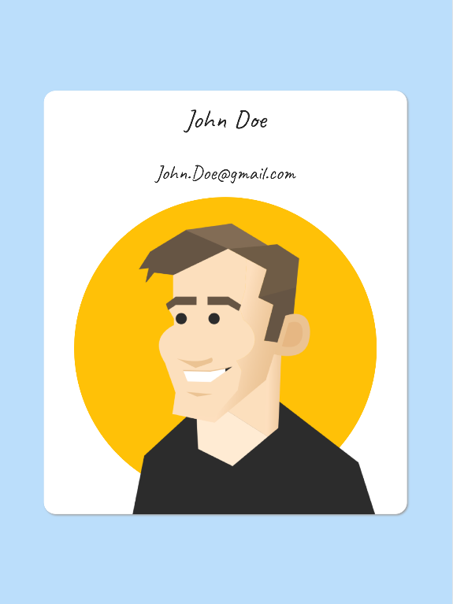
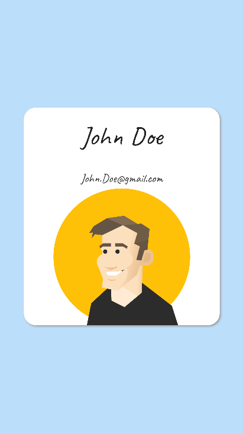

# Introduction

Simple Portfolio UI build with Flutter. 

- Caveat - Google Fonts used.
- Horizontal flip on profile avatar. 
- Responsive to desktop, tablet and mobile layout.

## Screenshots

## Getting Started

This project is built by Flutter application.

A few resources to get you started if this is your first Flutter project:

- [Lab: Write your first Flutter app](https://flutter.dev/docs/get-started/codelab)
- [Cookbook: Useful Flutter samples](https://flutter.dev/docs/cookbook)

For help getting started with Flutter, view 
[online documentation](https://flutter.dev/docs), which offers tutorials,
samples, guidance on mobile development, and a full API reference.

